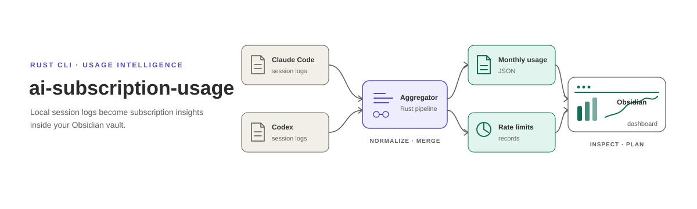

<p align="center"></p>

**English** | [日本語](README.ja.md)

`ai-subscription-usage` reads the local session logs that Claude Code and Codex CLI leave behind, aggregates how much each subscription was used, and writes the result into an Obsidian vault as JSON that a dashboard can render. The two providers are kept strictly apart — separate directories, separate files, never one combined figure — because a Claude token and a Codex token do not mean the same thing and their rate limits are measured against different denominators. Usage-limit consumption is never inferred from token counts: only values observed in the logs or returned by the provider's own API are recorded.

## Install

```bash
cargo install --path .
```

The binary is `ai-subscription-usage`. macOS only in practice: the Claude usage-limit fetch reads the OAuth token from the login keychain via `security`, and the scheduled jobs are launchd agents.

## Quick start

```bash
# Where to write. Defaults to the author's vault, so set it explicitly.
export OBSIDIAN_VAULT="$HOME/path/to/vault"

# Claude needs a price table before it will run. See docs/output.md.
mkdir -p "$OBSIDIAN_VAULT/_logs/_ai-subscription-usage/claude"
cat > "$OBSIDIAN_VAULT/_logs/_ai-subscription-usage/claude/pricing.json" <<'JSON'
{"models":{"claude-opus-5":{"input":5.0,"output":25.0,"cache_write_5m":6.25,"cache_write_1h":10.0,"cache_read":0.5}}}
JSON

# Scan without writing anything. Note the flag comes BEFORE the subcommand.
ai-subscription-usage claude --dry-run
ai-subscription-usage codex --dry-run

# Aggregate for real, then record the usage limits.
ai-subscription-usage claude
ai-subscription-usage claude limits
ai-subscription-usage codex
ai-subscription-usage codex limits
```

## Documentation

- [Use cases](docs/usecases.md) — what questions this answers, and what it deliberately refuses to answer.
- [CLI reference](docs/cli.md) — every subcommand and flag, including why flags must precede the subcommand.
- [Output files](docs/output.md) — what lands in the vault and in the long-term record, field by field.
- [Architecture](docs/architecture.md) — the common/provider split, incremental scanning, idempotency, token semantics.
- [Operations](docs/operations.md) — installing the launchd jobs, backups, and troubleshooting.

## License

MIT — see [LICENSE](LICENSE).
